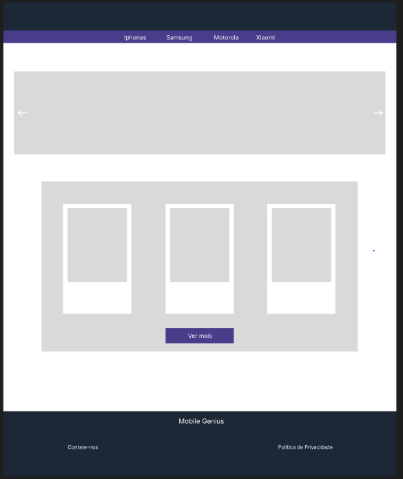
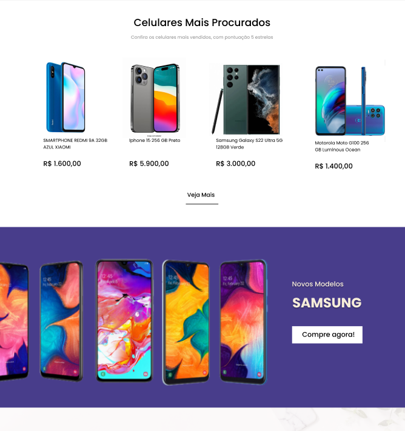
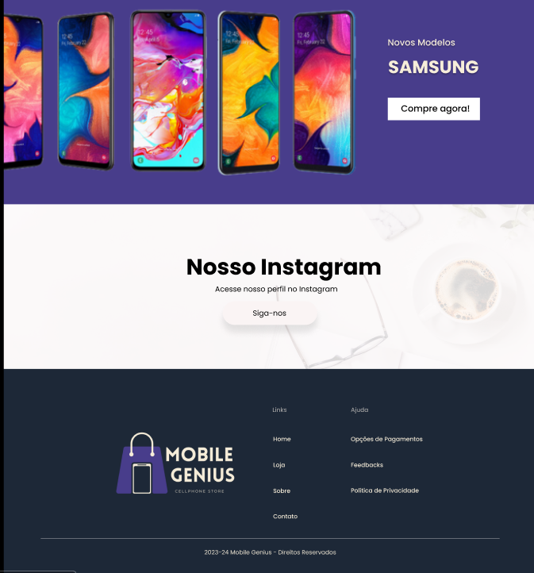
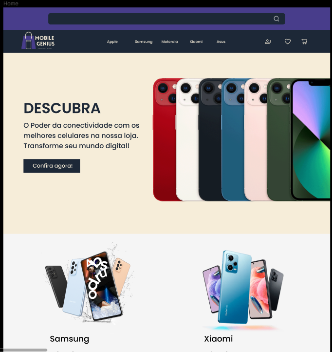
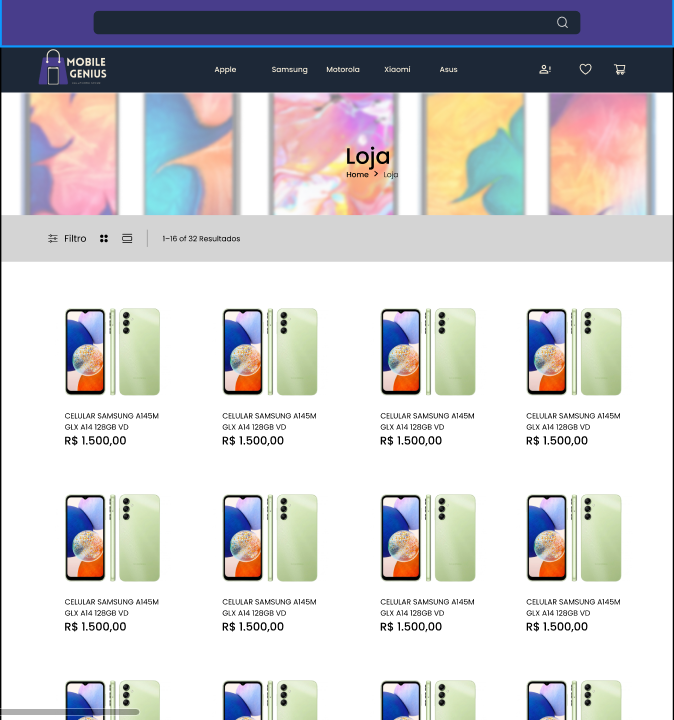
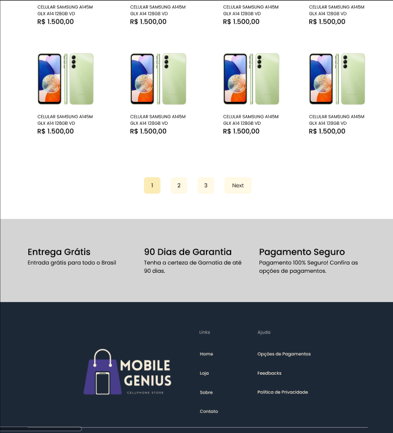
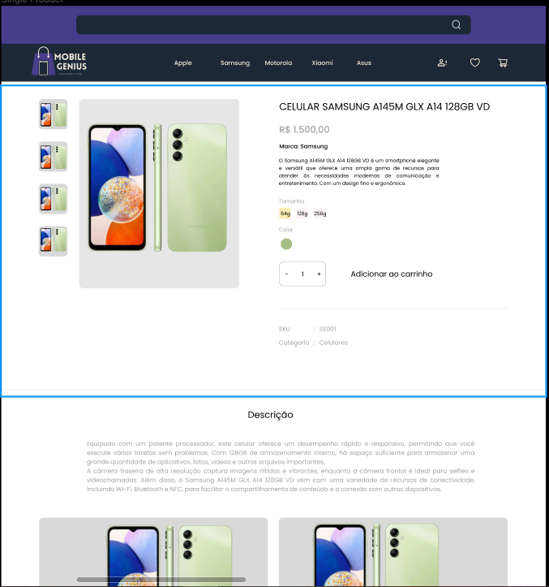
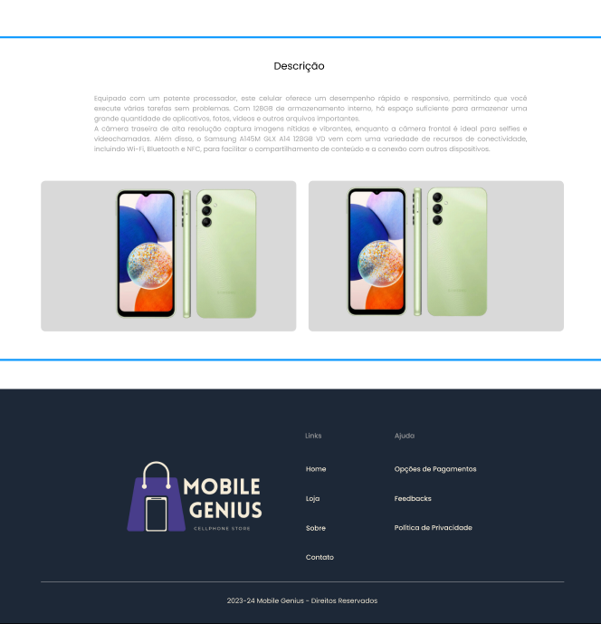
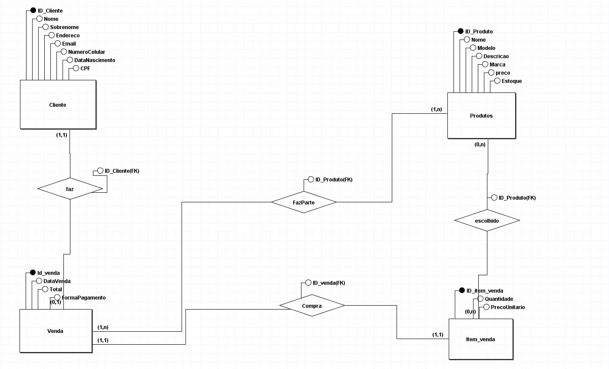
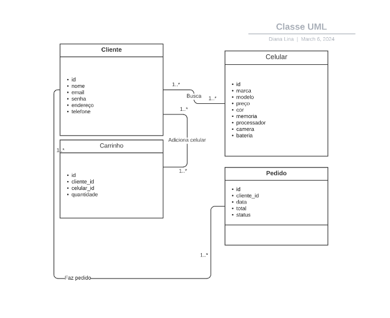

# Requisitos: 

*Cliente:*
- Cadastro de conta com informações pessoais.
- Exclusão de conta.
- Opções de pagamento.

*Produtos:*
- Adição de novos produtos.
- Remoção de produtos do catálogo.
- Atualização dos produtos.

*Compras:*
- Exibição de produtos com imagens, descrições e preços.
- Visualização detalhada de produtos.
- Adição de produtos ao carrinho.
- Remoção de produtos do carrinho.

# Protipação de Baixo Nível:

# Protipação de Alto Nível:

# Modelo de Entidade e Relacionamento

# Caso de uso com UML

