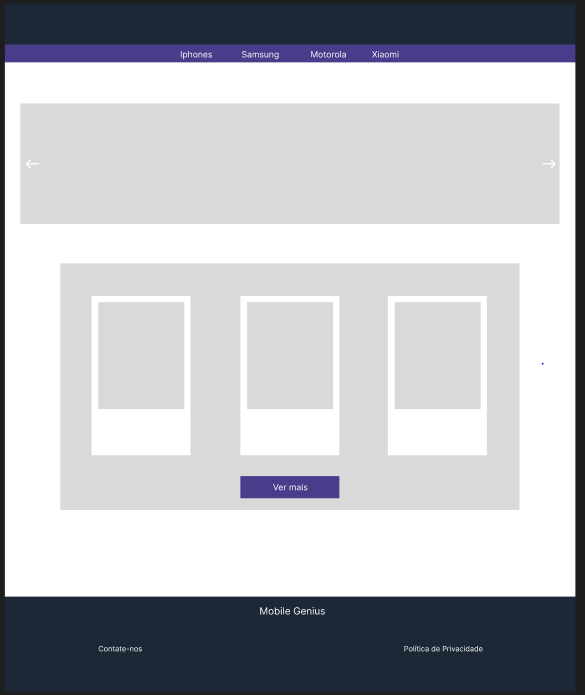

# Requisitos: 

*Cliente:*
- Cadastro de conta com informações pessoais.
- Edição de informações da conta.
- Exclusão de conta.
- Histórico de pedidos.
- Opções de pagamento.

*Produtos:*
- Adição de novos produtos.
- Remoção de produtos do catálogo.
- Edição de informações de produtos existentes.

*Compras:*
- Exibição de produtos com imagens, descrições e preços.
- Funcionalidade de busca.
- Visualização detalhada de produtos.
- Adição de produtos ao carrinho.
- Remoção de produtos do carrinho.

*Protipação de Baixo Nível:*

*Protipação de Alto Nível:*

